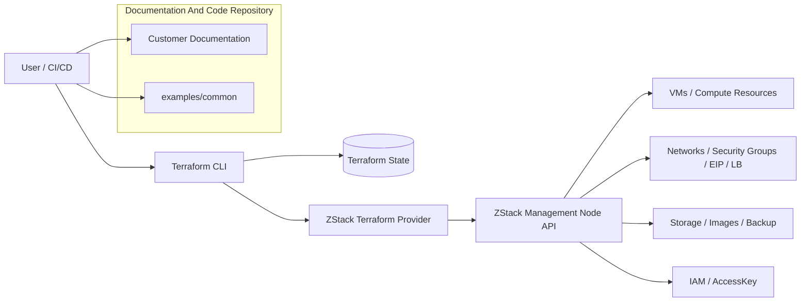
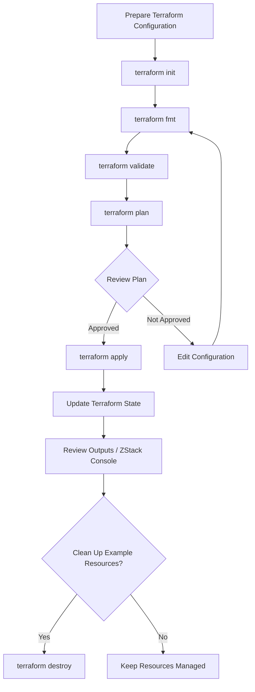
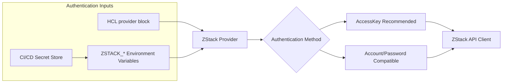
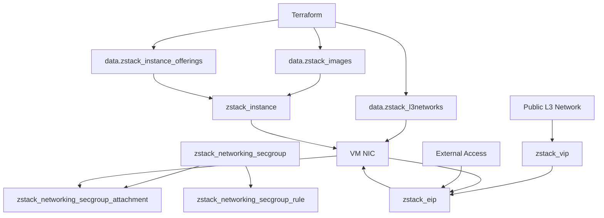
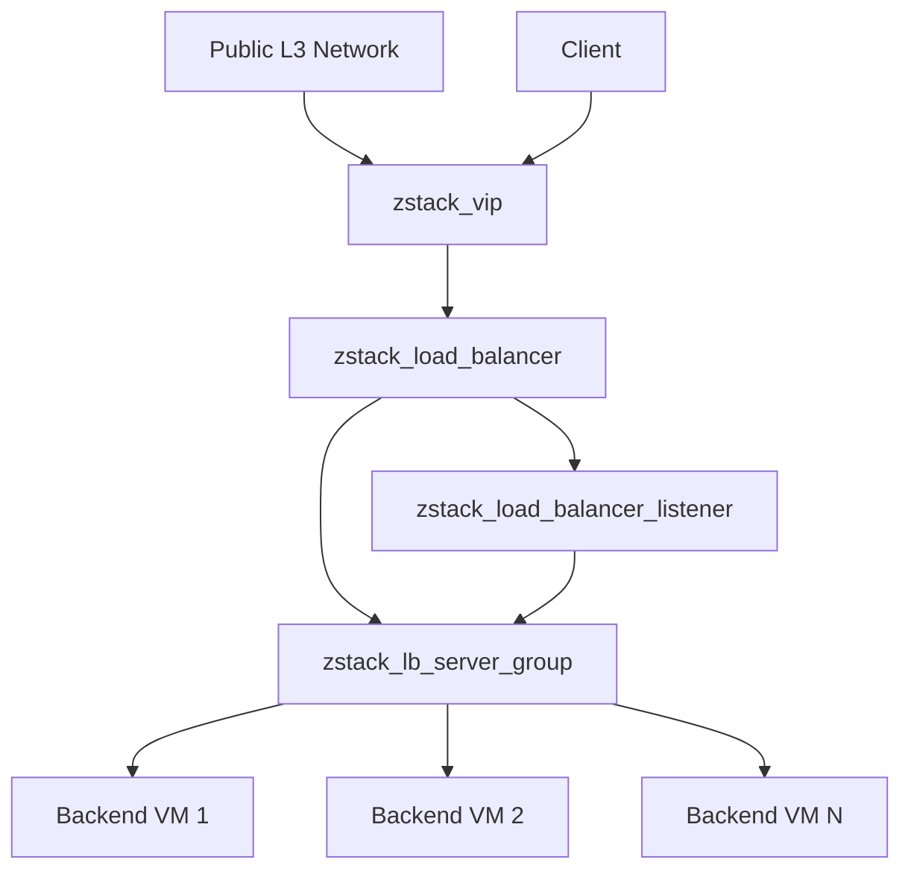
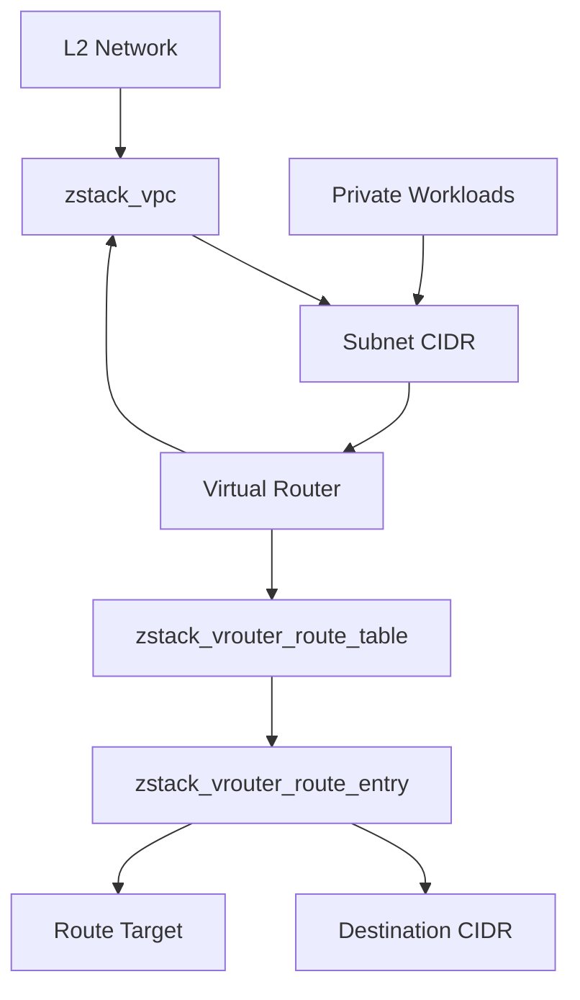

# Screenshots & Diagrams

This section references architecture diagrams, flow diagrams, and console
screenshots for the documentation package.

The current page publishes only Mermaid diagrams that can render directly in the
site. Console screenshots should be added only after they are captured from a
real ZStack environment and sanitized.

## Terraform And ZStack Interaction Architecture

## Terraform Execution Flow

## Provider Authentication Configuration

## VM + L3 + Security Group + EIP

## Load Balancer Web Scenario

## VPC Routing Scenario

