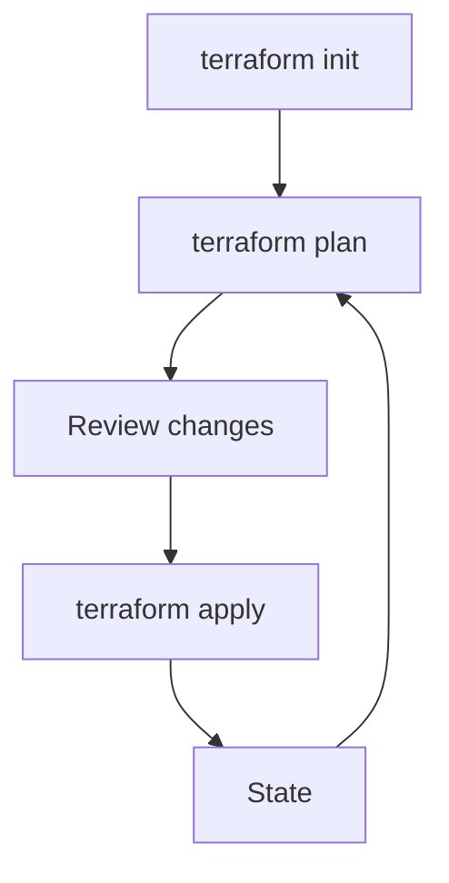

# Screenshots & Diagrams

This section records diagrams and screenshot requirements for the customer
documentation package.

## Architecture Diagrams

## Screenshot Backlog

- How to create or view AccessKey in the ZStack console.
- How to find resource UUIDs.
- VM, L3 network, security group, EIP, and load balancer views.
- Import workflow evidence from `terraform plan`.
