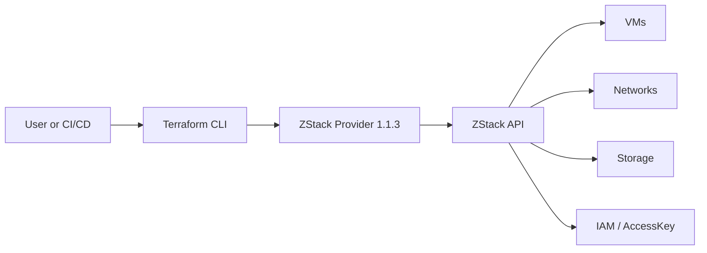
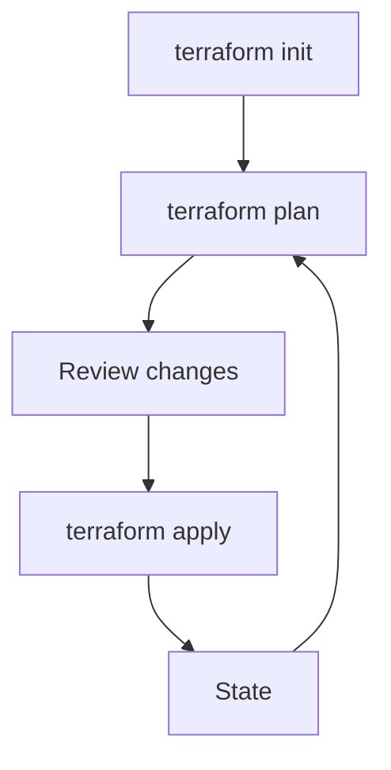

# Screenshots & Diagrams

This section publishes diagrams for the customer documentation package.
Console screenshots should be added only after they are captured from a real
ZStack environment and sanitized.

## Architecture Diagrams

