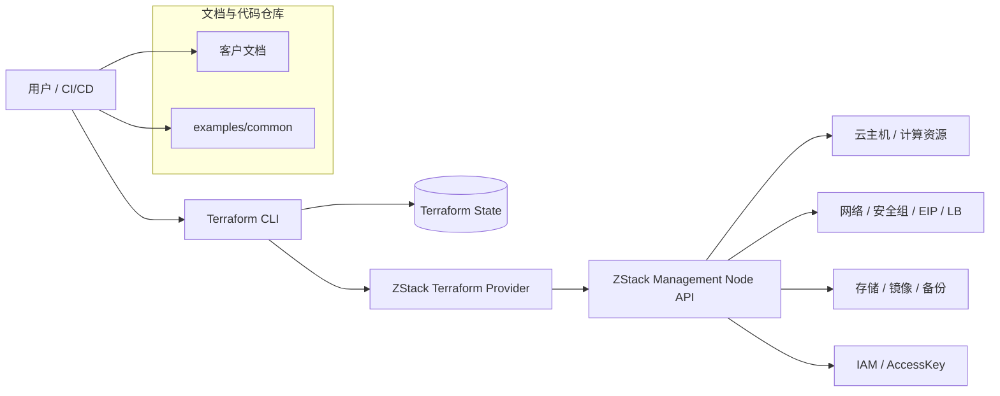
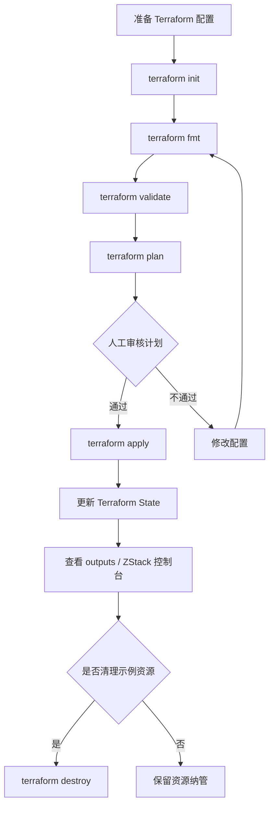
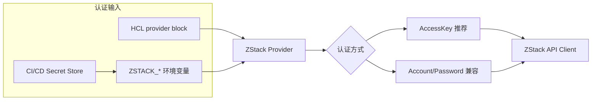
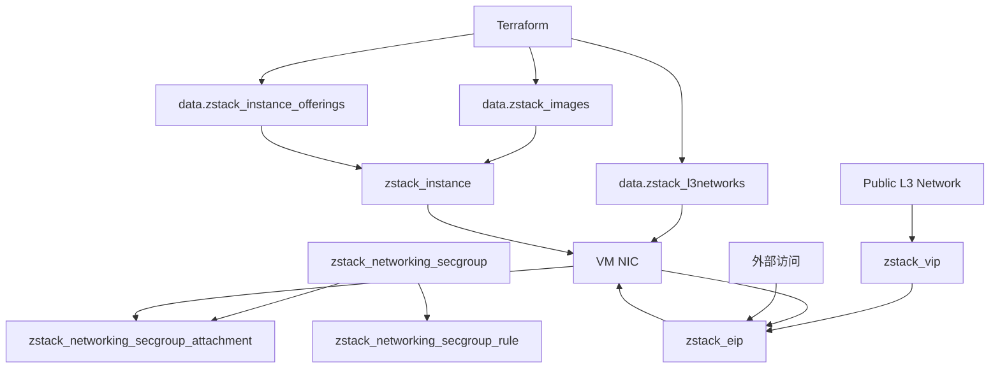
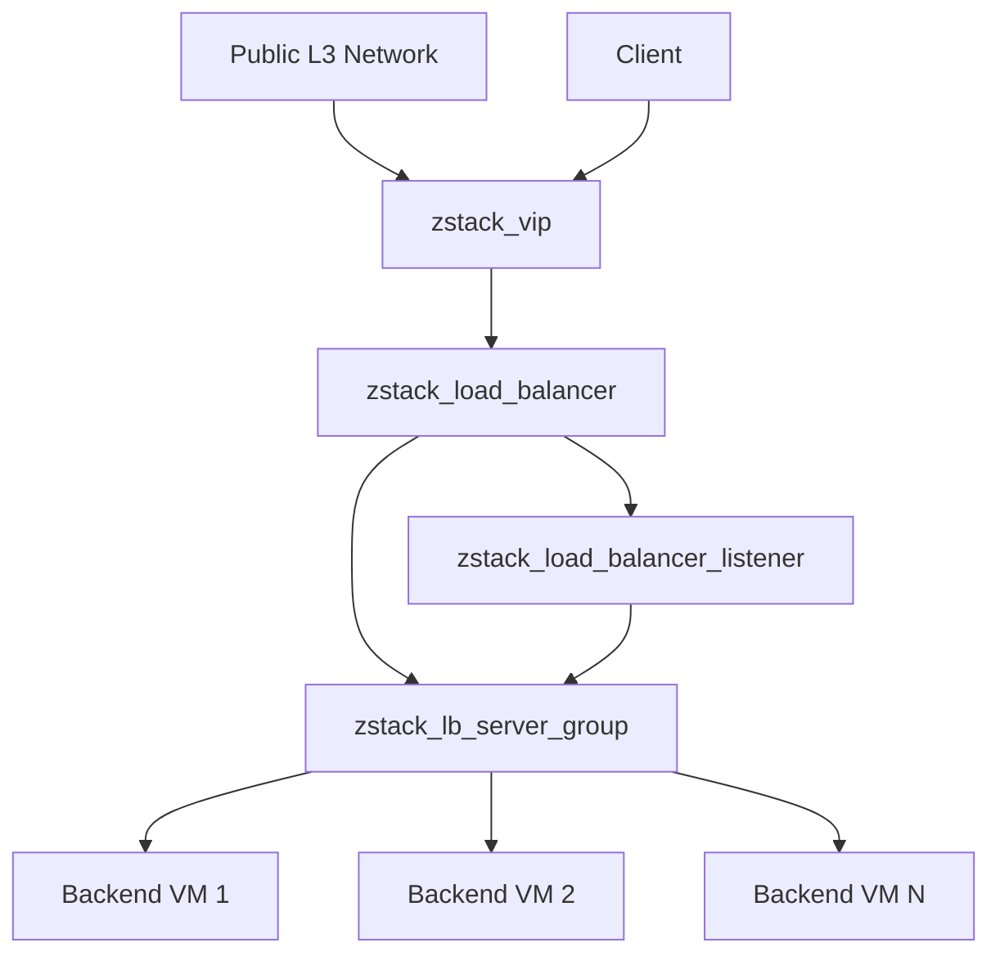
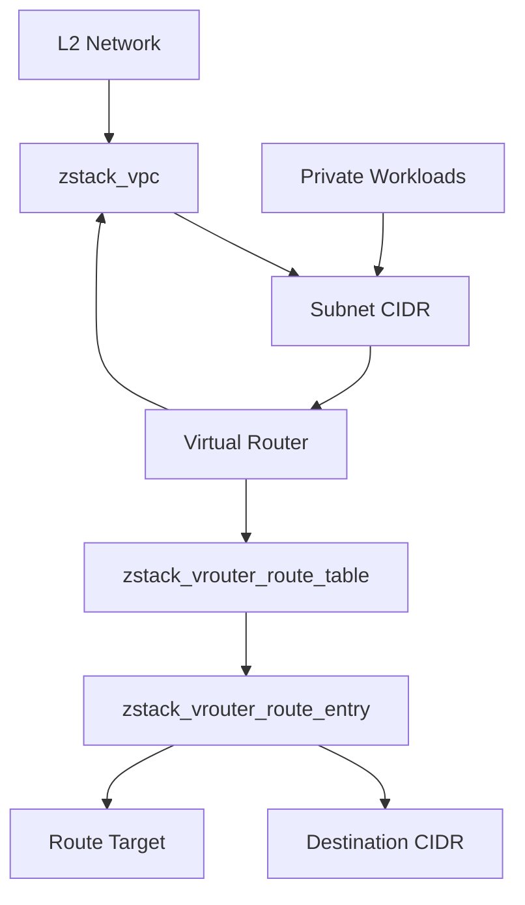

# 截图与架构图

本章节用于引用 `assets/diagrams` 和 `assets/screenshots` 中的架构图、流程图和控制台截图。

当前页面只发布可在站点中直接渲染的 Mermaid 架构图。控制台截图需要来自真实 ZStack 环境并完成脱敏后再发布。

## Terraform 与 ZStack 交互架构

## Terraform 执行流程

## Provider 认证配置

## VM + L3 + Security Group + EIP

## Load Balancer Web 场景

## VPC 路由场景

